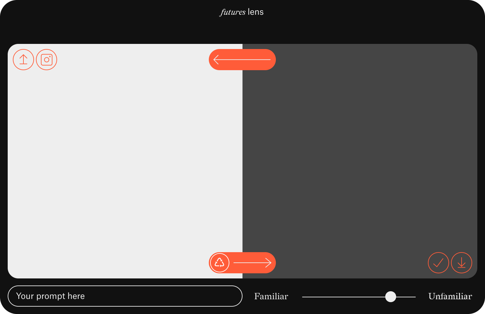

# Future Lens

Future Lens is a speculative design web app for transforming everyday objects into alternative future scenarios with AI. The interface combines image capture/upload, prompt-driven image generation, local history, and a canvas view for exploring transformation paths.



## What it does

- capture an image with the device camera or upload one from disk
- transform the image with a text prompt and a familiarity slider
- lock or randomize seeds for iterative exploration
- save generated variations into grouped local history
- revisit earlier results and reuse them as new inputs
- inspect saved transformations in a node-based canvas view
- run as a static PWA-style frontend deployed to GitHub Pages

## Tech stack

- **Frontend:** SvelteKit / Svelte 5 / Vite 7
- **Styling:** Tailwind CSS v4 plus app CSS custom theme tokens
- **Canvas graph:** Konva via `svelte-konva`
- **Persistence:** IndexedDB with migration from older `localStorage` history
- **Testing:** Playwright end-to-end tests
- **Deployment:** GitHub Pages via `.github/workflows/deploy.yml`

## Repository structure

```text
.
├── frontend/                 # SvelteKit application
│   ├── src/routes/           # Main app, about page, canvas view, workshop route
│   ├── src/lib/components/   # UI components
│   ├── src/lib/api/          # API client and retry logic
│   ├── src/lib/db/           # IndexedDB history storage
│   └── static/               # Manifest, service worker, assets
├── ui/                       # UI reference material and screenshot
├── UX_DESIGN.md              # UX and visual design notes
├── DEVELOPMENT_PLAN.md       # Feature roadmap
├── BACKEND_API_PLAN.md       # Backend/API ideas and extensions
└── PWA_ICONS_TODO.md         # Remaining PWA asset work
```

## Getting started

### Requirements

- Node.js 22.x recommended
- npm

### Install

```bash
cd frontend
npm ci
```

### Run locally

```bash
npm run dev
```

Then open the local Vite/SvelteKit URL shown in the terminal.

## Available scripts

Run these inside `frontend/`:

```bash
npm run dev      # start local dev server
npm run build    # create production build
npm run preview  # preview production build locally
npm run lint     # run Prettier check
npm test         # run Playwright end-to-end tests
```

If Playwright browsers are not installed yet, run:

```bash
npx playwright install
```

## Deployment

The project is configured for GitHub Pages deployment from the `main` branch. The workflow:

1. installs dependencies in `frontend/`
2. builds the static site with `BASE_PATH` set to the repository name
3. uploads `frontend/build/`
4. deploys via GitHub Pages

## API and data flow

- The frontend posts images and prompt parameters to an external transformation API.
- Generated images are shown immediately in the UI.
- Saved transformations are stored locally in IndexedDB and grouped by input image hash.
- Existing history in the older `localStorage` format is migrated automatically on startup.

## Additional documentation

- `/UX_DESIGN.md` for interface and visual design
- `/DEVELOPMENT_PLAN.md` for roadmap details
- `/BACKEND_API_PLAN.md` for backend expansion ideas
- `/PWA_ICONS_TODO.md` for remaining installable PWA assets